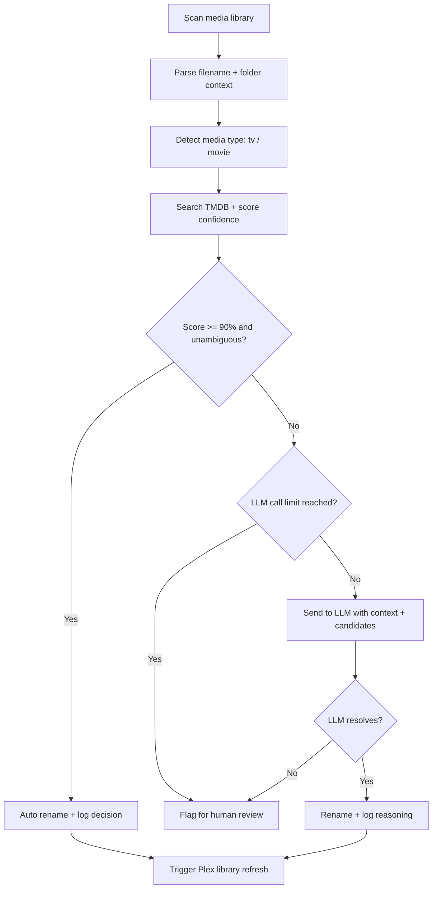

# media-agent

An AI-powered media file renaming agent for Plex servers. Scans a media library for badly named files, identifies them using TMDB, and renames them to [TRaSH-standard](https://trash-guides.info/) naming conventions so that Sonarr, Radarr, and Bazarr work correctly.

## The Problem

Sonarr, Radarr, and Bazarr depend on consistent file naming to manage metadata, subtitles, and upgrades. Poorly named files break this chain. This agent fixes the root cause — the filename — so all existing tools start working again automatically.

## Pipeline



The LLM is only invoked when deterministic confidence scoring fails — keeping API usage minimal and latency fast. In practice, ~98% of files are handled without an LLM call.

## Results

Ran against a real Plex library of ~1,300 media files:

| Action | Count |
|---|---|
| Auto renamed | 1,284 |
| LLM resolved | 15 |
| Flagged for review | 11 |
| Skipped | 6 |
| LLM calls made | 15 / 25 |

All decisions are logged to SQLite with reasoning traces, making it easy to audit and debug edge cases.

## Naming Convention (TRaSH Standard)

**TV Shows**
```
/mnt/media/TV Shows/
└── Show Name (Year)/
    └── Season 01/
        └── Show Name (Year) - S01E01 - Episode Title.mkv
```

**Movies**
```
/mnt/media/Movies/
└── Movie Title (Year)/
    └── Movie Title (Year).mkv
```

## Tech Stack

| Component | Tool |
|---|---|
| Language | Python 3.12 |
| Agent framework | LangChain 0.3.0 |
| LLM inference | Groq (LLaMA 3.3 70B) |
| Media metadata | TMDB API |
| Fuzzy matching | thefuzz + python-Levenshtein |
| Decision logging | SQLite |
| Plex integration | plexapi |
| Dependency management | uv |
| Linting / formatting | ruff |

## Project Structure

```
media-agent/
├── agent/
│   ├── core.py              ← main agent pipeline (orchestration only)
│   └── tools/
│       ├── scanner.py       ← finds badly named files
│       ├── parser.py        ← extracts title/season/episode/year from filename
│       ├── confidence.py    ← fuzzy matches parsed info against TMDB results
│       ├── metadata.py      ← TMDB API calls
│       ├── renamer.py       ← builds TRaSH-standard paths and renames files
│       ├── logger.py        ← logs all decisions to SQLite
│       ├── llm.py           ← LLM disambiguation logic
│       ├── media_type.py    ← detects tv vs movie from parsed context
│       └── plex_refresh.py  ← triggers Plex library refresh after renames
├── tests/
│   ├── unit/                ← 78 tests, no API calls required
│   └── integration/         ← hits real TMDB API, run locally only
├── db/                      ← SQLite databases, one per day (gitignored)
├── pyproject.toml
├── config.py
└── .env.example
```

## Confidence Scoring

Each TMDB candidate is scored using a weighted combination of:

- **Title fuzzy match** (60%) — uses the best of `token_sort_ratio` and `ratio` from `thefuzz`
- **Year match** (30%) — exact match only
- **Popularity boost** (10–30%) — weighted higher when no year is available, helps disambiguate common titles like *The Office*

A score ≥ 90 triggers an automatic rename. Below 90, or when the top two candidates are within 25 points of each other, the file is escalated to the LLM.

## Setup

### 1. Clone the repo

```bash
git clone https://github.com/qjsmith/media-agent.git
cd media-agent
```

### 2. Create virtual environment

```bash
uv venv
source .venv/bin/activate
uv sync
```

### 3. Configure environment variables

```bash
cp .env.example .env
```

Edit `.env`:

```
GROQ_API_KEY=...
TMDB_API_KEY=...
PLEX_URL=http://your-plex-ip:32400
PLEX_TOKEN=...
MEDIA_PATH=/mnt/media
```

### 4. Run in dry run mode first

In `agent/core.py`, set `DRY_RUN = True`. This logs what the agent *would* do without moving any files. Review the output and SQLite log before setting it to `False`.

```bash
python -m agent.core
```

### 5. Review decisions

```bash
sqlite3 db/media_agent_YYYY-MM-DD.db "SELECT action, COUNT(*) FROM decisions GROUP BY action;"
sqlite3 db/media_agent_YYYY-MM-DD.db "SELECT filename, reasoning FROM decisions WHERE action='flagged';"
```

## Configuration

| Flag | Location | Default | Description |
|---|---|---|---|
| `DRY_RUN` | `agent/core.py` | `True` | Log actions without renaming files |
| `CONFIDENCE_THRESHOLD` | `agent/core.py` | `90.0` | Minimum score for auto rename |
| `LLM_CALL_LIMIT` | `agent/core.py` | `25` | Max LLM calls per run |

## Testing

```bash
# Run unit tests (no API keys needed)
pytest tests/unit/ -v

# Run integration tests (requires TMDB_API_KEY in .env)
pytest tests/integration/ -v
```

Unit tests are fully isolated — all external API calls are monkeypatched. Integration tests hit the real TMDB API and are intended for local use only.

CI runs on every push and PR to `main` via GitHub Actions (`ruff check` + `pytest tests/unit/`).

## Scheduling

The agent runs nightly via cron on the host machine. Two jobs are registered:

```
0  2 * * *  cd ~/media-agent && git pull >> cron.log 2>&1
15 2 * * *  cd ~/media-agent && venv/bin/python -m agent.core >> cron.log 2>&1
```

The first job pulls the latest code from GitHub before each run, ensuring the server is always running the latest version without manual deploys.